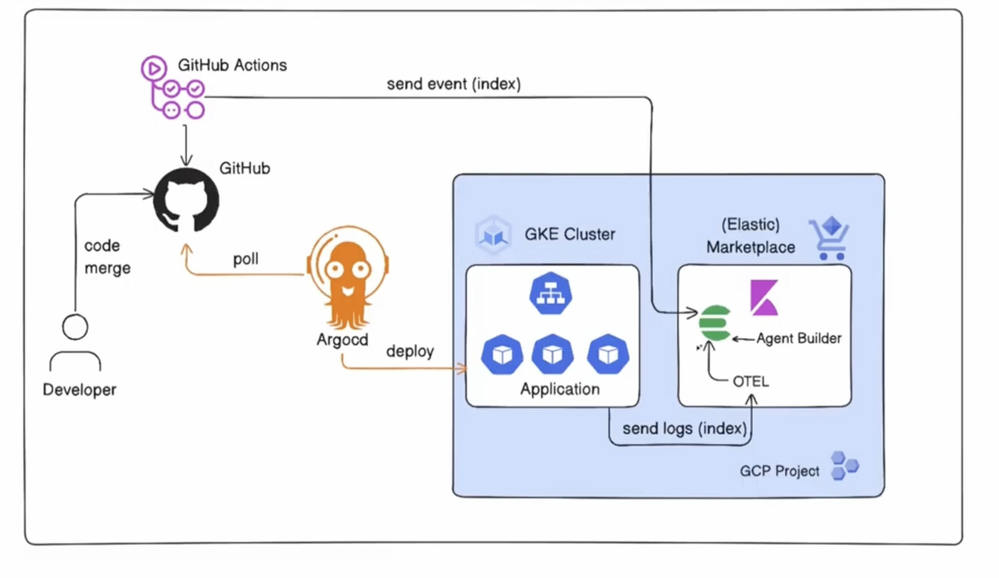

# 🤖 AI Observability Agent on Kubernetes — "Blame the Deploy"

An end-to-end SRE platform that connects Kubernetes production failures to the Git commits that caused them — with AI-assisted root cause analysis in seconds.

Built on **AWS EKS**, **Elastic Cloud**, **OpenTelemetry**, **ArgoCD**, and **Elastic Agent Builder**.

## 📺 Demo Video

<!-- TODO: Replace DEMO_VIDEO_URL with your recording link (YouTube, Google Drive, etc.) -->

TO BE ADDED

[](DEMO_VIDEO_URL)


<!-- TODO: Add 1–2 sentence summary after recording -->

## 🏗️ Architecture

[](./Architecture_Diagram.png)

## 📖 Project Overview

Most observability stacks tell you **that** a pod crashed. They rarely tell you **which commit** or **which deploy** caused it. Bridging that gap usually means a war room — `kubectl` archaeology, Slack threads, and guesswork.

This project eliminates that gap by design: every deploy is indexed, every crash is logged, and an AI agent joins the two datasets on demand.

### **What I Built**

- **Dual-pipeline GitOps architecture** — a single `git push` triggers both cluster deployment (ArgoCD) and deploy-metadata indexing (GitHub Actions → Elasticsearch)
- **OpenTelemetry observability pipeline** on EKS — kube-stack collectors shipping pod logs and Kubernetes events to Elastic Cloud
- **Deploy metadata index** — a GitHub Actions workflow that records who deployed what, when, and which commit changed on every push
- **AI SRE agent** with dedicated tools to pull crash logs and deploy history, correlating live telemetry with recent changes into an actionable root-cause answer

### **Live Demo Scenario**

1. A manifest change sets `paymentservice` memory limits dangerously low
2. ArgoCD deploys to EKS → pod **OOMKills** → **CrashLoopBackOff**
3. OpenTelemetry streams crash events to Elasticsearch in real time
4. GitHub Actions records the deploy with author and commit SHA
5. SRE asks the agent: *"Why is paymentservice crashing?"*
6. Agent returns root cause, commit, author, and remediation — revert via Git → ArgoCD self-heals

### **Technologies & DevOps Practices Demonstrated**

#### **Platform Engineering & Integration**
- Designed a multi-system workflow spanning Git, CI, Kubernetes, observability, and AI — all triggered by one event
- Chose complementary tools for each concern: GitOps for deploys, OTel for telemetry, Elasticsearch for correlation, Agent Builder for triage
- Built a standalone, production-shaped repo with clean separation of manifests, workflows, and runbook

#### **AI-Augmented SRE**
- Implemented the tool-calling agent pattern — the LLM orchestrates structured queries against live cluster and deploy data, returning evidence-backed root-cause summaries
- Authored custom agent tools and system prompts for OOMKill → deploy correlation
- Delivered auditable incident response — every tool call and query result is inspectable in Kibana

#### **Observability (Elastic Cloud + OpenTelemetry)**
- Deployed OpenTelemetry kube-stack on EKS for centralized log and event ingestion
- Structured log search for OOMKill detection across namespaces
- ES|QL joins across heterogeneous indices (runtime logs + CI metadata)

#### **GitOps (ArgoCD)**
- Git as single source of truth with automated sync and self-healing reconciliation
- Tuned sync interval for fast feedback loops during incident demos
- Deployment strategies configured for reliable failure and recovery scenarios

#### **CI/CD & Automation (GitHub Actions)**
- Event-driven workflow: manifest diff → service detection → Elasticsearch indexing
- Secrets-managed authentication to Elastic Cloud API
- Zero self-hosted runner overhead — GitHub-hosted infrastructure

#### **Cloud-Native Operations (AWS EKS)**
- Multi-AZ EKS cluster with managed node groups for microservices + observability stack
- IAM access control, LoadBalancer services, and regional Elastic Cloud deployment
- Resolved real EKS operational issues: server-side ArgoCD install, kubeconfig auth, cluster sizing for 12+ workloads

## 🛠️ Tech Stack

| Layer | Technology |
|-------|------------|
| **Compute** | Amazon EKS, managed node groups, `eksctl` |
| **GitOps** | ArgoCD |
| **Observability** | Elastic Cloud, OpenTelemetry kube-stack |
| **Data store** | Elasticsearch |
| **CI metadata** | GitHub Actions |
| **AI agent** | Elastic Agent Builder, ES\|QL tools, Claude |
| **Cloud** | AWS |

## 📁 Repository Structure

```
ai-observability-agent-kubernetes/
├── README.md
├── SETUP.md                           ← full deployment runbook
├── release/
│   └── kubernetes-manifests.yaml      ← ArgoCD-managed workloads
└── .github/workflows/
    └── index-deploy.yml               ← deploy metadata → Elasticsearch
```

## 🚀 Getting Started

See **[SETUP.md](./SETUP.md)** for the complete build guide.

## 🎯 Impact

| | Traditional approach | This platform |
|--|---------------------|---------------|
| **Find bad commit** | Manual cross-reference across kubectl, Git, Slack | Agent correlates logs + deploy index |
| **Root cause analysis** | Senior SRE time in war room | Natural-language query, seconds |
| **Audit trail** | Fragmented across tools | Unified in Elasticsearch |
| **Recovery** | Manual rollback coordination | Git revert → ArgoCD self-heal |

**Progression:** automate deployment → monitor health → correlate failures to source commits with AI.

## 👤 Author

**Girik Garg** — [LinkedIn](https://www.linkedin.com/in/girik-garg)

